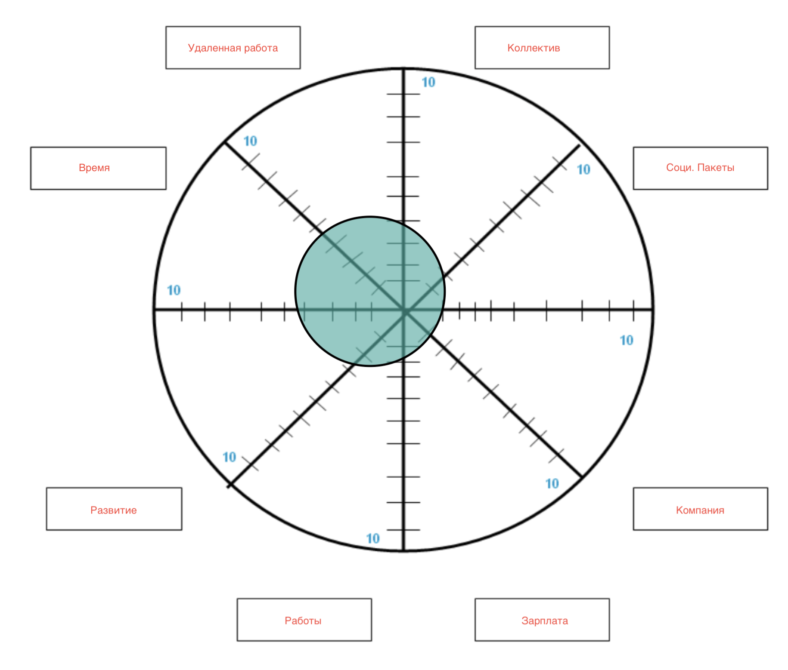
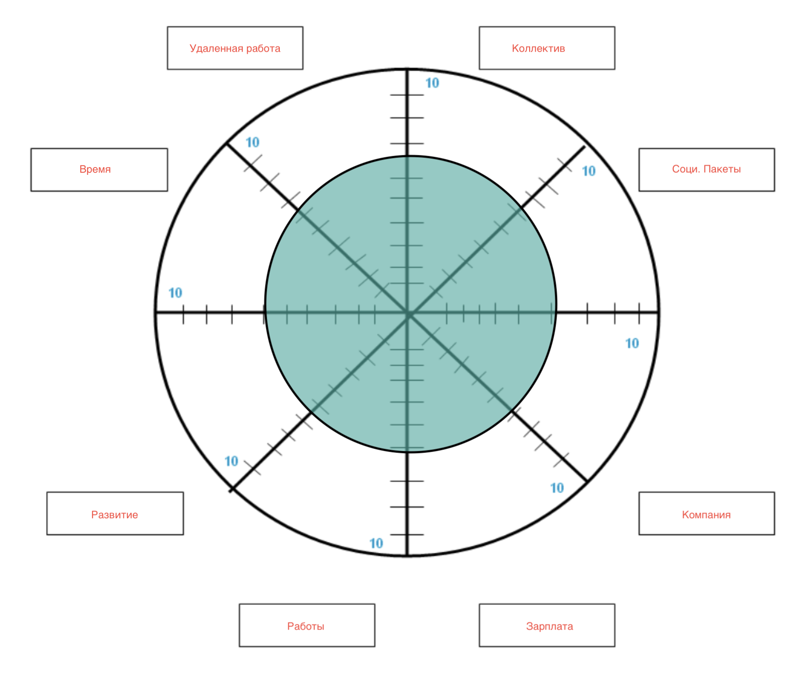

# Without Miro.

# Right Now

1. Удаленная работа     -   4,5
2. Коллектив            -   4
3. Соц.Пакеты           -   2
4. Компания             -   1
5. Зарплата             -   1,5
6. Работы               -   2
7. Развитие             -   2,5
8. Время                -   4

# What will be in 5 years.

 

1. Удаленная работа     -   8
2. Коллектив            -   7
3. Соц.Пакеты           -   6
4. Компания             -   6
5. Зарплата             -   6
6. Работы               -   6
7. Развитие             -   6,5
8. Время                -   6

# Explanation

* Удалённая работа — это когда человек выполняет свою работу не в офисе, а дома или в любом другом удобном месте. Для этого нужны компьютер, интернет и программы для общения с коллегами и выполнения задач. Важно уметь самостоятельно планировать своё время, потому что часто можно работать по гибкому графику.

* Коллектив — это группа людей, которые работают вместе для достижения общей цели. Например, сотрудники в одной компании, ученики в одном классе или спортсмены в одной команде. В коллективе люди помогают друг другу, делятся идеями и совместно решают задачи.

* Социальные пакеты — это дополнительные преимущества, которые работники получают от компании помимо зарплаты. Это может быть медицинская страховка, оплачиваемый отпуск, больничные и другие льготы.

* Компания (место) — это организация или фирма, где работают люди. Например, магазин, завод или офис. Надежда на то, что попаду в хорошую компанию.

* Зарплата — это деньги, которые человек получает за свою работу. Это плата за выполненные задачи и потраченное время.

* Работа — это то, чем человек занимается, чтобы зарабатывать деньги. Это могут быть различные задания и обязанности.

* Развитие — это процесс, когда человек учится новому, улучшает свои навыки и знания. Это помогает стать лучше в своей работе или достигать новых целей.

* Свободное время — это время, когда человек не занят работой или другими обязательствами. В это время можно отдыхать, заниматься хобби или проводить время с семьёй и друзьями.
