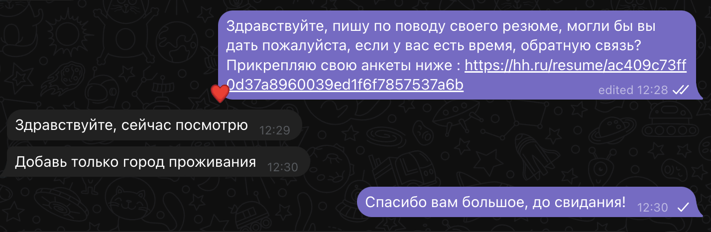

# Exercise 00. Resume from hh.ru
!()[https://hh.ru/resume/ac409c73ff0d37a8960039ed1f6f7857537a6b]

Рустемов Рустем Ранифович

Мужчина, 22 года, родился 14 ноября 2001

+7 (937) 7715255 — предпочитаемый способ связи

enjelendjob@mail.ru

Проживает: Казань

Гражданство: Россия, есть разрешение на работу: Россия

Не готов к переезду, не готов к командировкам

Желаемая должность и зарплата

Программист

Специализации:

Программист, разработчик

Занятость: полная занятость

График работы: полный день

Желательное время в пути до работы: не имеет значения

Образование

Неоконченное высшее
Казанский (Приволжский) федеральный университет, Казань
2025

Институт вычислительной математики и информационных технологий, Прикладная математика и информатика

Ключевые навыки

Знание языков
Русский — Родной
Навыки
Git; HTML; XML; Java; Linux; Python

### Exercise 01. Connection with programmer

- - 1. Found programmer.

- - 2. Asked for help.

- - 3.

- - 4. Changed some litgle issues. Added where im live.

### Exercise 02. Letter.

- 1.

- 2. Два вопроса.

  -  Зачем ты нужен компании? 
  -  Зачем компания нужна тебе?

    # Зачем ты нужен компании?
    Я представляю ценность для вашей компании в области программирования по нескольким причинам. Во-первых, мой опыт и знания в области разработки программного обеспечения позволят мне эффективно решать задачи, стоящие перед командой разработки. Я обладаю навыками в различных языках программирования и технологиях, что позволяет мне адаптироваться к новым проектам и быстро решать возникающие задачи.

    Кроме того, я стремлюсь к постоянному самосовершенствованию и обучению, что помогает мне оставаться в курсе последних тенденций и лучших практик в области программирования. Моя готовность к изучению новых технологий и подходов делает меня ценным активом для вашей команды, поскольку я готов принимать участие в различных проектах и приносить новые идеи и решения.

    Кроме того, я обладаю коммуникативными навыками и умением эффективно работать в команде. Я готов сотрудничать с другими членами команды, обмениваться знаниями и опытом, чтобы достичь общей цели – создания высококачественного программного продукта.

    В целом, я уверен, что мой опыт, навыки и стремление к профессиональному росту сделают меня ценным членом вашей команды по программированию, способствуя достижению общих целей и успеху компании.

    # Зачем компания нужна мне?

    Компания для меня является не только местом работы, но и площадкой для реализации моих профессиональных амбиций и целей. Вот несколько причин, по которым компания является важным местом для моего развития:

    1. **Профессиональный рост:** Я ищу компанию, которая ценит и поощряет профессиональный рост своих сотрудников. Я стремлюсь к постоянному развитию своих навыков и знаний, и важно, чтобы компания предоставляла мне возможности для обучения и карьерного роста.

    2. **Рабочая атмосфера:** Для меня важно работать в атмосфере, где ценится коллективная работа, открытость и взаимная поддержка. Я верю, что только в такой атмосфере можно достичь выдающихся результатов и достичь успеха в профессиональной деятельности.

    3. **Инновации и технологии:** Я хочу быть частью компании, которая активно развивается и следит за новыми тенденциями в отрасли. Важно для меня иметь возможность работать с современными технологиями и участвовать в инновационных проектах.

    4. **Карьерные возможности:** Компания, которая предоставляет своим сотрудникам широкие возможности для роста и развития карьеры, привлекает меня. Я стремлюсь к тому, чтобы мой вклад в компанию был признан и вознагражден, и я готов активно вносить свой вклад в успех компании.

    В целом, компания для меня является партнером в достижении моих профессиональных целей и амбиций. Я ищу компанию, с которой я смогу расти и развиваться вместе, достигая новых вершин в мире бизнеса и технологий.
